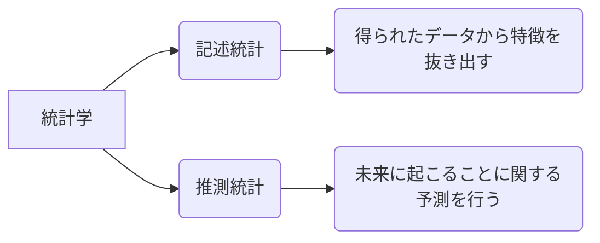
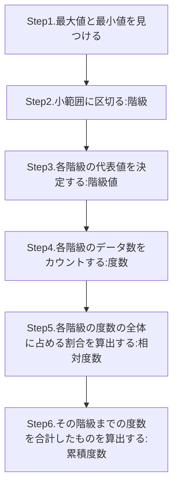
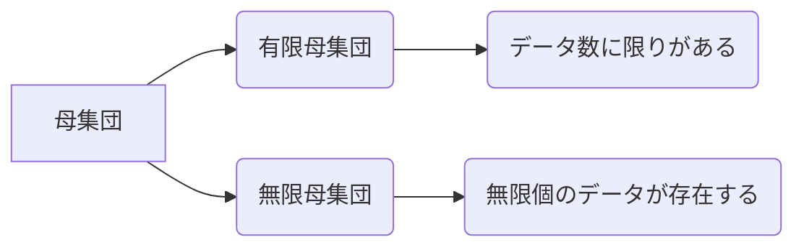

# 第1部「標準偏差から検定・区間推定まで」a
## 第0+1講
本書の最終目標：「**データ分布・標準偏差・平均値が不明な状態で、母集団を推定する**」

標準偏差を主軸に置き、理解を進めていく。

統計学とは**データとしてある数字を、何かの基準で整理整頓し、意味のある情報を抽出する作業**である。

手法としては、大まかに分けて2つ。
１．グラフ化してその特徴を捉える
２．１つの数字で特徴を代表させる

### ヒストグラムの作り方

作り方そのものより、統計用語に着目する。

## 第2講
* 平均値：言わずもがな。データ分布の代表値。
```math
 平均値 = Σ（階級値　×　相対度数）
```
厳密には異なるが、平均値という統計量には大きな影響はない。
性質としては、
1. データは平均値周辺に分布
2. 多く表れる平均値への影響力は大きい
3. ヒストグラムが左右対称のとき、対称軸が平均値

## 第3講
 * 偏差：あるデータから平均値を引いたもの。データの偏り。
 
 当たり前だが、偏差を導出して算術平均を取ると0になる
 偏差を２乗して算術平均を取ると、分散が求まる。
```math
 分散 = Σ(i=1,n)偏差(i)^2 / 全データ数
```
分散に√を取ると、標準偏差となる。
```math
 標準偏差(S.D.) = √分散
```
* 標準偏差：あるデータの平均値からの偏り。
* 分散：全体のばらつき具合の指標。
### 度数から標準偏差を求める
結論から言うと、
```math
 Σ{(階級値 - 平均値)^2 × (相対度数)} = 分散	(*)
 √分散 = 標準偏差
```
相対度数は、
```math
 相対度数 = 度数 / 全データ数
```
であることを思い出す。すると(*)は、
```math
 Σ{(階級の偏差)^2 × 度数 / 全データ数} = 分散
```
と書き直すことが出来る。

## 第4講
S.D.（図内ではσ）とは、すなわち**データの特殊性を評価する基準値**である。
データセットが正規分布であると仮定すると、平均値から±1の範囲内におよそ7割、
±2の範囲内に9.5割のデータが含まれる。
 
 
 ### データに一定数を加えて加工する場合
 ```mermaid
graph LR
A(1,2,3,4,5) --> B(5,6,7,8,9)
C( ΣA/5 = 3) --> D( ΣB/5 = 7)
E( -2,-1,0,1,2) --> F( -2,-1,0,1,2)
G(ΣE^2 / 5 = 2) --> H(ΣF^2 / 5 = 2)
I(G^1/2 = 2^1/2) --> J(H^1/2 = 2^1/2)
```
従って、平均値以外の統計量は変化しない。

### データに一定数を掛けて加工する場合
 ```mermaid
graph LR
A(1,2,3,4,5) --> B(2,4,6,8,10)
C( ΣA/5 = 3) --> D( ΣB/5 = 6)
E( -2,-1,0,1,2) --> F( -4,-2,0,2,4)
G(ΣE^2 / 5 = 2) --> H(ΣF^2 / 5 = 8)
I(G^1/2 = 2^1/2) --> J(H^1/2 = 8^1/2)
```
従って、分散はx^2倍、その他（平均値、偏差、S.D.）はx倍になる。

以上の結果を踏まえると、
```math
 [データ - 平均値] / S.D.
 ```
 というデータ加工を行うことにより、
 ```math
  平均値 = 0 , S.D. = 1
  ```
と表せることが分かる。
## 第5講
平均値は寄せ集めの値でしかない。
正しく評価するためには、S.D.も併せて確認しよう。

## 第6講
S.D.の概念がある以上、リターンとリスクの一定の比例関係は崩せない。
経済学では、シャープレシオ（tanθ=リターン/リスク）という概念により商品評価を行っている。

## 第7講
* 標準正規分布：-∞～∞までの数値データからなる、0点を軸に左右対称な分布
$$
f(x) = \frac{1}{\sqrt{2\pi}}\exp^{{\frac{1}{2}}{x^2}}
$$
ある階級は、相対度数によって表される。
### 標準正規分布の性質
* 平均値 = 0 , S.D. = 1
*  S.D.±1の範囲に7割、S.D.±2の範囲に9.5割のデータが存在
これを一般正規分布へ変換するためには、
```math
 一般正規分布のデータ = σ × （標準正規分布のデータ） + μ
 ```
σ,μは任意の定数。
第4講の考察から、一般正規分布は
```
 平均値 = μ , S.D. = σ のデータ集合である
```
と言い換えることが出来る。
逆に一般正規分布から標準正規分布へ変換するには、
```math
 z = ( x - μ ) / σ
 ```
という加工を行えば良い。
つまり、このzは**平均値からS.D.いくつ分離れているか**を意味するものであり、**正規分布は平均値と標準偏差を与えると一種類に決まる**という事実を示すものである。

コイン投げの正規分布近似として、以下の法則が知られている。（要証明）
```
 コインをN枚同時に投げて、そのうち何枚が表になったかを記録する。
 表の出た枚数Xの出た相対度数のヒストグラムを作ると、それは近似的に、
 平均値 = N/2 , S.D. = √N/2
 の正規分布となる。
```
## 第8講
不確実現象が正規分布であると判明している場合、正規分布を用いて統計的推定を行うことが出来る。
標準正規分布の性質より、S.D.からの乖離具合によりデータ数が限定されることを利用する。
汎用されているのは**95%的中**or**99%的中**であるが、本書では95%で考察を行う。
S.D.±2の範囲に入る正確なデータ数は95.44%であるが、0.44%を取り除くため、S.D.の除算が**1.96以下-1.96以上**の範囲を95%的中範囲と定める。
他にも95%的中範囲は存在するが、予言的中確率の区間内で最短なものが上記に当たる。
具体的には、
```math
 一般正規分布 = σ × 標準正規分布 + μ
 ```
で表されることから、一般正規分布の的中区間は、
```math
 ( μ - 1.96σ )以上 ( μ + 1.96σ )以下
 ```
と書き表される。
逆に一般正規分布を標準正規分布に加工する方法を利用すると、
```math
 z = ( x - μ ) / σ
 ```
であることを考慮すると、
```math
 -1.96 ≦ ( x - μ ) / σ ≦ 1.96
 ```
と表される。
見かけは違えど、意味としては同じ。
要するに**平均値からS.D.何個分ずれてるのか**が出せれば良い。
## 第9講
統計的推定の目標は**いくつかのデータから母集団を推理すること**である。
* 母集団：背景にある全データのこと

例を挙げると、選挙の出口調査などが統計的推定に当たる。
統計的推定の代表的なものである「仮説検定」を行ってみる。
まずは以下を仮定する。
1. N枚のコインを投げる
2. 10枚表が出た
3. 表の出る確率は1/2である
4. 投げた枚数を次の数とするのは妥当か。①16枚 ②36枚

推定したいNを、母集団の持つ**母数**（パラメータ）と言う。
ここで母数は「想定される母集団の種類」に相当する。
***
### ①の場合
μ = 16/2 , S.D. = √16/2であることから、
```math
 -1.96 ≦ ( x - 8 )/2 ≦ 1.96 ⇔ 4.08 ≦ x ≦ 11.92
 ```
従って、妥当であると結論付けられる。

### ②の場合
同様に、
```math
 -1.96 ≦ ( x - 18 )/3 ≦ 1.96 ⇔ 12.12 ≦ x ≦ 23.88
 ```
従って、この条件は想定外である。
***
この時、2つの考え方を取ることが出来る。

考え方1. 母集団に対する仮説は正しく、5%の事象が起こってしまった。
考え方2. 母集団に対する仮説が正しくない

どちらともとれるが、統計学では考え方1を採用する。
従って、②の仮説は棄却される。
## 第10講
第9講で説明したような方法で「ありうる母数の入るべき区間」を予想することを**区間推定**と呼ぶ。
先ほどの例で言うと、13 ≦ N ≦ 30が95%信頼区間に当たる。（計算略）
よく間違えがちなのが、上記枚数は「表の枚数が10枚と観測されたとき、母数Nが95%の確率でこの区間内に収まる」という解釈である。
そもそもNは、「求まるものではなく、既に確定しているが知らない値」である。
「固定された母集団からどのデータが観測されるか」が不確実事象であり、確率的に数値が出るのは、**母数Nではなく、あくまでも観測される数値**のほうであることを忘れずに。
xを観測し、そのｘからzを計算しNを棄却していく作業を行った場合、本当の正しいNが生き残る確率は、各々の観測値xに対してどれも0.95となる。
どのようなxが出た場合でもこの方法でNを推定していく手続きを繰り返すなら、そのうち**95%の推定結果は当たっている**というのが正しい解釈である。
まとめると、「区間13 ≦ N ≦ 30に、本当のNとしてありうるものの95%が入る」というも見積もりではなく、「**区間推定という手続きを実行し続けるなら、観測値に対応して様々な区間が求まるが、その100回のうち95回は本当のNが求めた区間に入る**」という確率なのである。

次のステップとして「母集団が正規分布かつS.D.は判明している状態から、平均値の区間推定」を試みる。
まずは以下を仮定する。
1. 実際の温度μを平均とする
2. 標準偏差5℃の正規分布をする
3. 計測したデータは20℃であった

以上の仮定からzを推定する。
```math
 z = ( 20 - μ )/σ =( 20 - μ )/5
 ```
上記が95%推定区間を満たせば良いため、
```math
 -1.96 ≦ ( 20 - μ )/5 ≦ 1.96 ⇔ 10.2 ≦ μ ≦ 29.8
 ```
以上の結果より、上記範囲にてμが棄却されないことが導出された。
# 第2部「観測データから巨大な世界を推測する」
## 第11講

母集団の中には無数のデータが存在し、それぞれに抽出される確率が決定されている。
この確率（相対度数）は全て合計すると1になる。
この母集団から繰り返しデータを観測することを十分多くの回数実行し、ヒストグラムを作成すると、ヒストグラムはほぼ母集団と一致する。
このような仮定を**ランダムサンプリング**（無作為抽出）の仮定と呼ぶ。
データ観測数が膨大になるほど、母集団の様子は鮮明になる。
この仮定を利用すると、母集団の平均値（**母平均**）というものを
```math
 平均値μ = Σ( 階級値 × 相対度数 )
 ```
の関係性を用いて導出することが出来る。
この導出により、母集団はμ付近に分布していることを推測することが出来る。
## 第12講
データに標準偏差・分散があるのと同様に、母集団にもこれらは存在する。
```math
 偏差 = データ数 - 母平均μ
 母分散σ^2 = Σ ( 偏差^2 × 相対度数 )
 標準偏差σ = √母分散
 ```
により、導出できる。
## 第13講
ある母集団からランダムサンプリングされた一つのデータから、σの隔たりを経て、母集団の全体像を大まかに推測することが出来る。
正規分布でない一般の分布に対しても、σ × kを選ぶことで推測は可能である。
```math
 一般的にμからσ × k以上離れるデータは全体の1/k^2の比率以下しかない。
 ```
上記の法則は**チェビシェフの不等式**と呼ばれている。
もちろん複数のデータがあれば、より精度は向上する。
観測されたデータの平均値は、母平均と区別する意味で**標本平均**と呼ばれる。
```math
 標本平均 = 観測されたデータの合計値 / 観測データ数
 ```
上記平均を取る理由としては「偶然に起こるデータの散らばりを打ち消して、実際の値に近いものを作り出したいから」と考えて差し支えない。
この性質はいかなる母集団に対しても成り立ち、**大数の法則**と呼ばれ、一般化されている。
 **1つの母集団かn個のデータを観測し、その標本平均$\bar{x}$を作る。
 このときnが大きければ大きいほど、標本平均は母平均μに近い数値を取る可能性が高くなる。**
## 第14講
通常標本平均を行って分布を調べると、母集団の分布とは異なる。
（例として、サイコロの出目を考えると１～６まで母集団分布は均等であるが、平均にすると母平均3.5を中心とした山なりとなる）
しかし、母集団が正規分布しているもの（正規母集団）は、「標本平均を作っても、その分布は正規分布のまま」という特徴がある。
ただし、$\bar{x}$の分布の平均値はμのままだが、標準偏差は$\frac{σ}{\sqrt{n}}$となって、母集団に比べて$\sqrt{n}$分の1に縮む。
ここで標準平均$\bar{x}$の標準偏差というのは、「n個の具体的な標本から標準偏差を計算したものではない」ことに注意。
ここでいう標準偏差は、n個のデータを観測することを無限に繰り返し、それから計算した無数の標本平均$\bar{x}$のヒストグラムを作り、それに対して計算した標準偏差のことである。
要するに、無限の$\bar{x}$から作った母集団の母分散のようなもの。
また正規母集団に対する標本平均の分布は、平均値近くの値が高い確率で観測されるため、母集団よりそそり立つような形になる。
正規母集団で95%予言的中区間を言い換えると、「母平均μから標準偏差σの1.96倍の範囲内にあるデータが観測される」とすればよい。
この法則を「正規母集団からn個のデータを観測する場合、その標本平均に対する予言をするならどの範囲を指定すればよいか」という形にバージョンアップする。n個の標本平均の分布では、平均値は母平均μから変化せず、標準偏差は母標準偏差σの$\frac{1}{\sqrt{n}}$になるため、当然以下のようになる。
```math
 母平均がμで母標準偏差がσの正規母集団からのデータn個の標本平均に対する95%予言的中区間は、
 （ μ - 1.96*σ/√n）以上（ μ + 1.96*σ/√n ）以下
 ```
また、以下でも表すことが出来る。
$$ -1.96 \leq \frac{\bar{x}-\mu}{\frac{\sigma}{\sqrt{n}}} \leq 1.96$$
式からも分かる通り、観測データが増えるほど精度は向上する。
## 第15講
何か特定の不確定現象の素性を知りたい場合、正規母集団の母平均ないし母標準偏差を推定することで、その代用になる。
母集団の分布さえわからない場合の推定方法は以下2つ。
1. 大量にデータを取れば、母集団がどんな分布でもその標本平均は正規分布に近くなるという性質（中心極限定理）を利用すること：大標本の推定と呼ばれる
2. 分布についての知識を仮定しない「ノンパラメトリック」という方法を利用すること

上記は非常に難しい推定の為、本書では扱わない。
最も自然で実用的な「正規母集団だと判明していて、母平均も母分散も分からない時の推定」を目指す。
まずは、母分散が分かっている正規母集団の母平均を区間推定することを試みる。
以下を仮定する。
* 作成するおにぎりの重さの全データを母集団とする
* これは正規母集団であり、母標準偏差が10gであることが分かっている
* 25個作成したところ、標本平均は80gであった

14講より、標準偏差は
```math
 標準偏差 = 母標準偏差/√n = 10/√25 = 2
 ```
従って、標本平均$\bar{x}$は母平均μを平均値とする、標準偏差σ = 2の正規分布となる。
ここから母平均の信頼区間を計算すると、$$-1.96 \leq \frac{80-\mu}{2} \leq 1.96\Longleftrightarrow76.08 \leq \mu \leq 83.92$$と求めることが出来る。
以上の具体例を一般化していく。
***
母集団は正規分布していることと母標準偏差σは既知であるとする。
この母集団から観測したデータはn個で
```
 x1,x2,･･･xn
 ```
と表す。
このとき、
1. n個のデータを観測して標本平均$\bar{x}$を計算することを繰り返すなら、$\bar{x}$の分布は平均値が（母集団と同じ）μで、S.D.は母集団のものより$\frac{σ}{\sqrt{n}}$に縮む。
2. n個のデータの標本平均が入る範囲を、データを観測する前に予言するなら、平均からS.D.の1.96倍以下の離れ方である、という意味の$$ -1.96 \leq \frac{\bar{x}-\mu}{\frac{\sigma}{\sqrt{n}}} \leq 1.96$$という不等式を解くことで得られる「$\bar{x}$の範囲」を予言することで、95%の確率で当たる予言を作れる。
3. 現実の観測データから、母集団の母平均μを逆に推定する場合は、「現実に観測した標本平均$\bar{x}$が予言の範囲に入るような母平均μを持つ母集団だけを妥当なもの」として残し、その他のμを持つ母集団を棄却する。
4. 上記不等式ではσとnは知っていて、$\bar{x}も観測データから計算されているので、この不等式が成り立つμだけを、妥当な母平均の推定値として残す、とすれば良い。
5. 不等式を計算することにより母平均の範囲が絞れる
***
このような手順を、**母平均の区間推定**と呼ぶ。
## 第16講
標本分散という概念を取り入れる。
```math
 偏差 = 標本 - 標本平均
 標本分散s^2 = Σ偏差^2 / ｎ
 ```
母分散σ^2とは区別されている。
式から分かるように、分散は正規分布とはならない。
上記の証明を試みるため、まずは**カイ二乗分布**について理解する。
標本分散の中で二乗の和の部分にのみ着目する。
さらに母集団の正規分布も標準正規分布に限定し、「標準正規分布する母集団から出てきたn個のデータの二乗の和」という統計量を分析する。
標準正規分布から3個のデータを観測し、二乗して合算した統計量Vを考える。$$V = x_1^2 + x_2^2 + x_3^2$$
自由度別のカイ二乗分布を以下に示す。（上記は自由度3）


自由度kとは、観測値のデータ数と考えて問題ない。
n個のデータだと「自由度nのカイ二乗分布」となる。
カイ二乗分布の特徴としては、
1. 0近辺の相対度数が大きい
2. 自由度kが大きくなるにつれて山の高さが低くなり、極限値が右側へシフトする

1.は正規分布0付近の数値の相対度数が大きいことを反映している。
2.は自由度が大きくなると、0から離れたデータが出る相対度数が高まることを表す。
以下に自由度3のV別の相対度数を示す。
| V | x以上の出る相対度数 |
|-----------|------------|
| 0    | 1	     |
| 1    | 0.8012  |
| 2    | 0.5724  |
| 3    | 0.3916  |
| 4    | 0.2614  |
| 5    | 0.1717  |
| 6    | 0.1116  |
上表より4以上のものが26.14%を占めることが分かる。
数値xのとなりにある数値は「ｘ以上のデータが全体に対してどのくらいの比率を占めるか」を表す。
## 第17講
以下に自由度別の95%信頼区間を示す。
| 自由度 | 0.975 | 0.025 |
|------|-------------|-----------|
| 1    | 0.001       | 5.023     |
| 2    | 0.0506      | 7.377     |
| 3    | 0.2157      | 9.3484    |
| 4    | 0.4844      | 11.1433   |
| 5    | 0.8312      | 12.8325   |
| 6    | 1.2373      | 14.4494   |
例えば、自由度3の95%予言的中区間は
```math
 0.2157 <= V <= 9.3484
```
と読み取れる。
上記を利用して、正規母集団の区間推定を試みる。
母平均μ、母標準偏差σの正規母集団からの標本xより、$$ z =  \frac{x - \mu}{\sigma}$$として、統計量zを作ると、zが標準正規分布になることから、σを知っていればμの区間推定が出来る。
正規母集団からn個のデータが観測されたら、$$\frac{x_1 - \mu}{\sigma},\frac{x_2 - \mu}{\sigma},\frac{x_3 - \mu}{\sigma}\cdots$$を作る。
上記は統計量zと同じものであるから、標準正規分布に従う。
従って、以下の式が成り立つ。
$$V=\bigl(\frac{x_1 - \mu}{\sigma}\bigr)^2+\bigl(\frac{x_2 - \mu}{\sigma}\bigr)^2+\cdots+\bigl(\frac{x_n - \mu}{\sigma}\bigr)^2$$
```
母平均μ、母標準偏差σの正規母集団からn個の標本を観測し、上式という形でVを計算すると、統計量Vは自由度nのカイ二乗分布をする。
```
これまでの議論とカイ二乗分布の95%予言的中区間を利用すれば、母分散を区間推定することが出来る。
以下を仮定し、早速具体例を見ていく。
* ある蝶の母平均は80mmの正規母集団
* 観測した3個体の体長は76mm,85mm,83mmであった
3個体から統計量Vを作成すると、$$V=\bigl(\frac{x_1 - \mu}{\sigma}\bigr)^2+\bigl(\frac{x_2 - \mu}{\sigma}\bigr)^2+\bigl(\frac{x_3 - \mu}{\sigma}\bigr)^2=\frac{50}{\sigma^2}$$と導出できる。
このVは自由度3のカイ二乗分布するデータの中の一つであるため、「**現在95%予言的中区間の中の数値を観測しているはず**」という考え方を受け入れることになります。
従って、「σを事前に知っていて、観測値から計算したVの値が95%予言的中区間に入らないようなσは棄却する」ということ。
表より、$$0.2157 \leq \frac{50}{\sigma^2} \leq 9.3484 \Longleftrightarrow 5.34 \leq {\sigma^2} \leq 231.80$$が95%信頼区間に当たる。すなわち、母標準偏差の信頼区間は、$$2.31 \leq {\sigma} \leq 15.22$$と表される。

## 第18講

<!--stackedit_data:
eyJoaXN0b3J5IjpbMjAxMTU2Mzg3OCwyNzA2MzMyODVdfQ==
-->